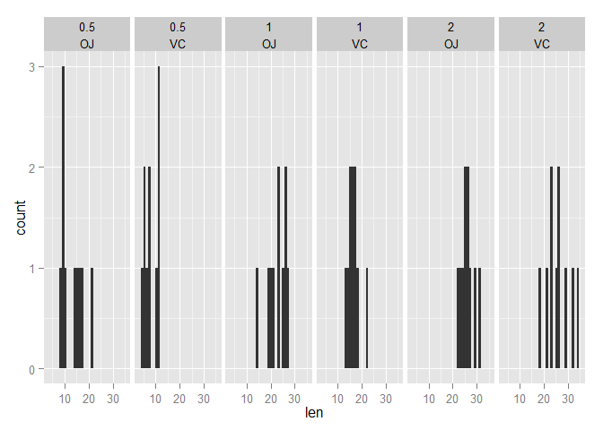

# Toothgrowth Analysis


## Overview

This is an R Markdown document to analyze the ToothGrowth dataset in the R datasets package.
In the dataset, the response is the length of odontoblasts (teeth) in each of 10 guinea pigs at each of three dose levels of Vitamin C (0.5, 1, and 2 mg) with each of two delivery methods (orange juice or ascorbic acid).

This analysis conducted T test to test if different levels of Vitamin C have different effect on tooth growths.

## Data Exploration

Load necessary libraries

```r
library(ggplot2)
library(datasets)
```


We first load data and explore what the data look like.

```r
data(ToothGrowth)
str(ToothGrowth)
```

```
## 'data.frame':	60 obs. of  3 variables:
##  $ len : num  4.2 11.5 7.3 5.8 6.4 10 11.2 11.2 5.2 7 ...
##  $ supp: Factor w/ 2 levels "OJ","VC": 2 2 2 2 2 2 2 2 2 2 ...
##  $ dose: num  0.5 0.5 0.5 0.5 0.5 0.5 0.5 0.5 0.5 0.5 ...
```

```r
head(ToothGrowth)
```

```
##    len supp dose
## 1  4.2   VC  0.5
## 2 11.5   VC  0.5
## 3  7.3   VC  0.5
## 4  5.8   VC  0.5
## 5  6.4   VC  0.5
## 6 10.0   VC  0.5
```

```r
summary(ToothGrowth)
```

```
##       len       supp         dose     
##  Min.   : 4.2   OJ:30   Min.   :0.50  
##  1st Qu.:13.1   VC:30   1st Qu.:0.50  
##  Median :19.2           Median :1.00  
##  Mean   :18.8           Mean   :1.17  
##  3rd Qu.:25.3           3rd Qu.:2.00  
##  Max.   :33.9           Max.   :2.00
```

```r
table(ToothGrowth$supp, ToothGrowth$dose)
```

```
##     
##      0.5  1  2
##   OJ  10 10 10
##   VC  10 10 10
```

Note that supp and does are categorical data with 2 levels and 3 levels repectively.
So the whole dataset is natually divided into 6 groups, with supp is either OJ or VC
and dose is 0.5, 1 or 2.

We'd like to plot out the lengths with respect to both supp and dose.


```r
xhist <- qplot(len, geom="histogram", data=ToothGrowth, facets = . ~ dose + supp)
xhist
```

 

For each dosage leve, supp groups (OJ or VC) have different means from the histograms. 
Next step is to do hypothesis testing to test if they are really different from each other.

## Hypothesis Test

With the assumption that the two supp groups are paird, 
we will go with this null hypothesis, 
mean tooth lengths are the same when dose is 0.5mg, 1mg or 2mg for "OJ" group and "VC" group. 

### dose is 0.5mg


```r
g1 <-ToothGrowth[ToothGrowth$supp=="OJ" & ToothGrowth$dose==0.5, 1]
g2 <-ToothGrowth[ToothGrowth$supp=="VC" & ToothGrowth$dose==0.5, 1]
mean(g1)
```

```
## [1] 13.23
```

```r
mean(g2)
```

```
## [1] 7.98
```
Noticing that the average of g1 is greater than g2, 
our alternative hypothesis is that the differnce in means is greater than 0.
That is, mean tooth growth of group "OJ" is greater than mean tooth growth of group "VC" when dose is 0.5.

Then we conduct T-Test.


```r
t.test(g1, g2, paired=T, alternative = "greater")
```

```
## 
## 	Paired t-test
## 
## data:  g1 and g2
## t = 2.979, df = 9, p-value = 0.007736
## alternative hypothesis: true difference in means is greater than 0
## 95 percent confidence interval:
##  2.02  Inf
## sample estimates:
## mean of the differences 
##                    5.25
```

Indeed, the test results reject the null hypothsis.
The statistically significant p-values indicate that when dosages is 0.5mg, orange juice is more effective at promoting tooth growth than just ascorbic acid.

### dose is 1mg and 2mg


Similarly we conduct T-Test for dose being 1mg and dose being 2mg.


```r
g1 <-ToothGrowth[ToothGrowth$supp=="OJ" & ToothGrowth$dose==1, 1]
g2 <-ToothGrowth[ToothGrowth$supp=="VC" & ToothGrowth$dose==1, 1]
mean(g1)
```

```
## [1] 22.7
```

```r
mean(g2)
```

```
## [1] 16.77
```

```r
t.test(g1, g2, paired=T, alternative = "greater")
```

```
## 
## 	Paired t-test
## 
## data:  g1 and g2
## t = 3.372, df = 9, p-value = 0.004115
## alternative hypothesis: true difference in means is greater than 0
## 95 percent confidence interval:
##  2.706   Inf
## sample estimates:
## mean of the differences 
##                    5.93
```
The test results also reject the null hypothsis.
That is, when dosages is 1mg, orange juice is also more effective at promoting tooth growth than just ascorbic acid.


```r
g1 <-ToothGrowth[ToothGrowth$supp=="OJ" & ToothGrowth$dose==2, 1]
g2 <-ToothGrowth[ToothGrowth$supp=="VC" & ToothGrowth$dose==2, 1]
mean(g1)
```

```
## [1] 26.06
```

```r
mean(g2)
```

```
## [1] 26.14
```

```r
t.test(g1, g2, paired=T, alternative = "less")
```

```
## 
## 	Paired t-test
## 
## data:  g1 and g2
## t = -0.0426, df = 9, p-value = 0.4835
## alternative hypothesis: true difference in means is less than 0
## 95 percent confidence interval:
##   -Inf 3.363
## sample estimates:
## mean of the differences 
##                   -0.08
```

The test does not reject the null hypothesis.
We cannot conclude that orange juice promotes tooth growth more effectively than just ascorbic acid.

# Conclusion

In this report, we analyzed the ToothGrowth data set.
We performed t-test on the dataset and found that orange juice promotes tooth growth more effectively than just ascorbic acid when dose is either 0.5mg and 1mg. We cannot reject the null hypothesis that orange juice and ascorbic acid have the same effect on promoting tooth growth when dose is 2mg.
No conclusion can be drawn from the test
